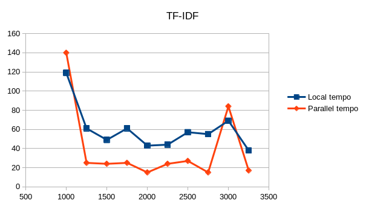
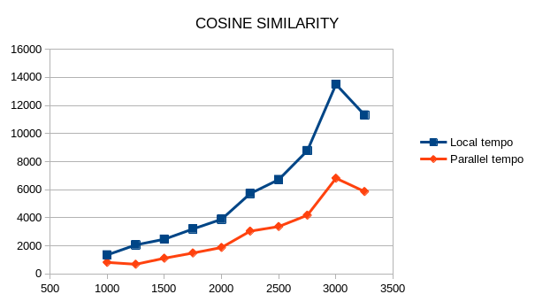
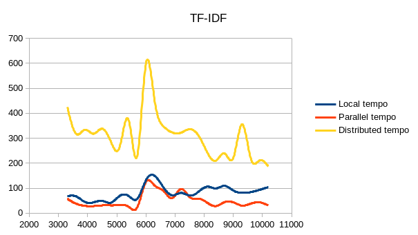
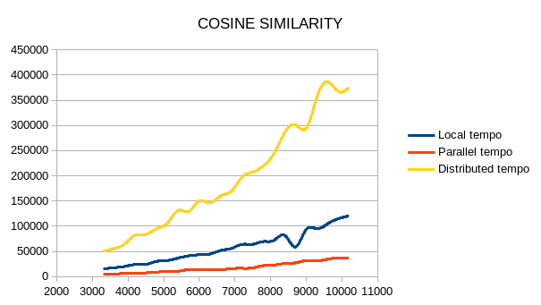

# Scalable and Cloud Programming Project
In this repository there is the exam project for the course of "Scalable and Cloud Programming" taken at University of Bologna in the academic year 2022/2023.
The aim of the project was to develop an application in Scala+Spark that takes advantage of a map-reduce implementation in order to obtain a result that is scalable in the cloud context. 

## The Problem and the Data
The aim of the project is to build a recommendation system based on Term Frequency - Inverse Document Frequency algorithm, we expect that this is the part of the project that will more benefit of the map-reduce approach. Then retrieve the correlation between the different documents by using cosine similarity as distance factor.

The cloud applications usually are in the context of big data, so a dataset on which an analysis' work can be performed is used in this project. In particular, the dataset used is freely available at the following link: https://www.kaggle.com/datasets/mrmorj/restaurant-recommendation-challenge .

The dataset contains the information about a food delivery application. In brief there are several customers and several restaurants, with related informations among them, each customers has its own order history. The problem has been approached by computing the TF-IDF with restaurants seen as documents, where the corpus is the 'tag' column (containing a series key-words related to the kind of kitchen of a restaurant). A recommendation can be achieved, for example, if an user has ordered from a restaurant we can retrieve the similar and suggest to the user. The dataset dimension is high but due to the specific filtering applied, necessary to handle the problem as specified  by us, the resulting dataset is not enough to appreciate a distributed execution.

Then a second dataset, for which the same algorithm can be executed, that is much bigger has been used for the effective tests. The dataset is the one at the link: https://www.kaggle.com/datasets/arashnic/book-recommendation-dataset. It is a dataset containing informations about books and readers ratings. In that case the documents are the books, and the corpus is the title of the specific book.

## Execute code on Google Cloud Platform
With all the dependencies installed, the code can be runned as follows:
1. * Check if the code executes by running (in the project directory):
   ```sh
   sbt run
   ```
   * Create a '.jar' package using the following command:
   ```sh
   sbt package
   ```
2. Download the datasets (or only one) at the links before
3. Create a new bucket inside the project in Google Cloud Platform 
4. Copy the package created inside `ScalableAndCloudProgrammingProject/target/scala-2.12/` to the bucket with the following command:
   ```shell
   gsutil cp package.jar gs://bucketName
   ```
5. Copy the datasets in the bucket with the command before (necessary files are: 'train_full.csv' and 'orders.csv' for Delivery dataset, 'Books.csv' for Books)
   * Be careful to change tha Paths variables in the code with the 'bucketName' defined   
6. Create a Compute Engine Cluster on Google Cloud Platform
   * To obtain best results change the RDD partitions number with respect to the cluster cores number in the code
7. Create and send a new job by:
   1. Select the created cluster
   2. Choose "Spark" job  as "Type of job"
   3. Type `gs://bucketName/tfidfRecommender.jar` in "Main class or jar" 

## Tests
Three versions of the algorthm are compared to empirically found if the problem under analysis enjoys the distributed paradigm. There is a sequential version, a parallel and a distributed one. The differences are mainly in the data type, Array for sequential, ParArray for parallel and RDD for distributed.

### Local
Tests executed on an Intel Core i7-8550U chip, 4 cores and 8 threads.





### Distributed
Tests executed on a cluster N1 with 8 virtual CPUs and 30GB of memory.





## Conclusion and future work
The plots shows improvements for the parallel version on the local machine and on the cluster for both the algorithms. 

Regarding the distributed version there are limitations due to the cluster used that isn't powerful than the local machine in terms of virtual CPUs, so the results are not faster. By incrementing the dimension of the input can be observed that:
	* TF-IDF: with the incrementation in dimension the algorithm improves in time, we can affirm that with even more data or better with more CPUs, the improvements will show up
	* Cosine Similarity: the formulation of that algorithm seems that cannot beneficiate of the map-reduce approach as the one before, so in a concrete version that part will be just parallelized
	
Anyway, even with really slow times, the used cluster is able to handle dimensions much bigger taking advantage of RDDs with respect to Arrays and ParArrays in the other versions. In particular, local and parallel version can handle up to '~10000' instances of the books dataset, while with RDDs dimensions up to '~36000' can be computed. 
